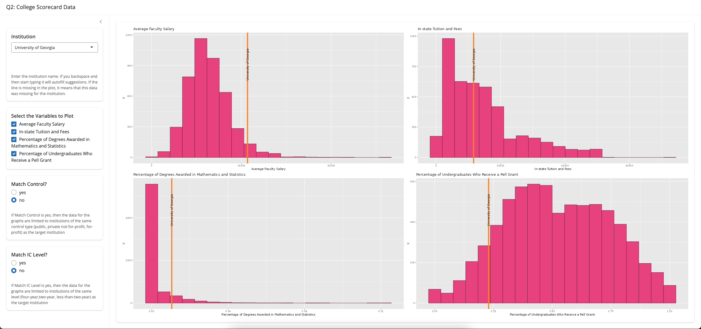

# Shiny-College-Data

## Overview

 This interactive R Shiny app allows users to explore the U.S. College Scorecard dataset by selecting a specific institution and choosing variables like tuition or faculty salary to plot. The app visualizes how the chosen college compares to others, with options to filter the comparison group.

 ## Link to App

 [Check it out here](https://g-whittington.shinyapps.io/Question2/)

 ## App Preview

 
